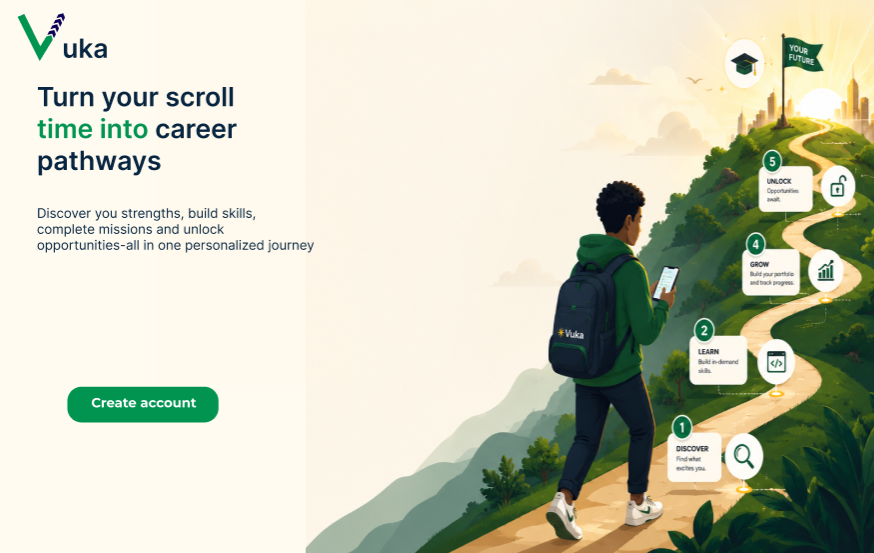

# Welcome to Vuka

  

    
<<<<<<< HEAD
    <h2>Discover. Learn. Grow.</h2>
=======
    <h2>Discover. Learn. Unlock.</h2>
>>>>>>> 4b87e283949b05cf400d7f83cceb78e7aa357aab
    

      An AI-powered learning and career development platform helping
      high school graduates in Kenya turn social media into purposeful learning.
    

  

  

    
   
  

  

    <h2>Learn Through Away Missions</h2>
    

      AI matches each learner's interests, strengths and career aspirations with relevant educational content from platforms such as YouTube and TikTok.
      Learners are then directed to relevant educational content on social media and return to Vuka to verify their learning through assessments.
    

    
  

  

    <h2>Turn Learning Into Opportunity</h2>
    

      Consistent learning, assessment performance and streaks unlock
      personalized scholarships, bootcamps and other opportunities.
    

     

  

    
    
    
    
  

<<<<<<< HEAD

  <a href="https://beta-informational-website.vercel.app/" class="md-button">
    Visit Vuka
  </a>

  <a href="getting-started/" class="md-button">
    Get Started
  </a>

=======
>>>>>>> 4b87e283949b05cf400d7f83cceb78e7aa357aab

---

  <strong>Vuka</strong> is an AI-powered learning and career development platform
  designed for high school graduates in Kenya. Vuka transforms casual social-media
  consumption into structured learning pathways by connecting learners with
  relevant educational content, verifying learning through assessments, tracking
  progress, and unlocking personalized opportunities such as scholarships and bootcamps.

---

## Our Vision

<<<<<<< HEAD
  <strong>Our Vision:</strong>
=======
>>>>>>> 4b87e283949b05cf400d7f83cceb78e7aa357aab
  <em>
    A future where every high school graduate in Kenya can transform the
    digital platforms they already use into pathways for learning,
    skills development, career growth and meaningful opportunities.
  </em>

---

## Our Mission

<<<<<<< HEAD
  <strong>Our Mission:</strong>
=======
>>>>>>> 4b87e283949b05cf400d7f83cceb78e7aa357aab
  <em>
    To bridge the gap between passive social-media consumption and
    purposeful learning by using AI to connect young people with
    relevant educational content, verify their learning, track their
    progress and connect them to real-world opportunities.
  </em>

---

## The Problem We Solve

  <h3>Too Much Information, Too Little Direction</h3>
  

    High school graduates have access to enormous amounts of information
    through social-media platforms such as TikTok and YouTube. However,
    finding reliable, relevant and structured educational content that
    supports their interests and career aspirations can be difficult.
  

  <h3>From Passive Consumption to Purposeful Learning</h3>
  

    Vuka bridges the gap between consuming content casually and using
    social media intentionally for learning and career development.
    Instead of leaving learners to navigate an overwhelming amount of
    unstructured information, Vuka creates personalized pathways based
    on each learner's interests, strengths and aspirations.
  

  <h3>From Discovery to Opportunity</h3>
  

    Vuka creates a continuous journey from
    <strong>discovery</strong> to <strong>learning</strong>,
    <strong>verification</strong>, <strong>progress</strong> and finally
    <strong>opportunity</strong>.
  

---

## How Vuka Works

  <h3>1. Discover</h3>
  

    Learners complete onboarding that captures their interests, strengths,
    career aspirations and preferred social-media platforms.
  

  <h3>2. Get Personalized Content</h3>
  

    Vuka uses AI-assisted matching to connect the learner's profile with
    relevant educational and industry-focused content from external
    sources such as YouTube and TikTok.
  

  <h3>3. Complete Away Missions</h3>
  

    Learners are directed to the recommended educational content on
    external social-media platforms. After learning, they return to Vuka
    to continue their learning journey.
  

  <h3>4. Verify Learning</h3>
  

    Learners complete assessments based on their recommended learning
    content. Their performance is used to verify understanding and
    contribute to their overall progress.
  

  <h3>5. Track Progress</h3>
  

    Vuka records assessment scores and learning streaks. Every submitted
    assessment contributes to the learner's progress and encourages
    consistent learning.
  

  <h3>6. Unlock Opportunities</h3>
  

    Strong performance and consistent learning can unlock personalized
    opportunities such as scholarships, bootcamps and other development
    programs.
  

---

## Why Vuka?

  <h3>AI-Powered Personalization</h3>
  

    Vuka uses AI-assisted matching to understand each learner's profile
    and connect them with educational content relevant to their interests
    and career aspirations.
  

  <h3>Learning Through Familiar Platforms</h3>
  

    Instead of asking young people to abandon platforms they already use,
    Vuka transforms platforms such as YouTube and TikTok into tools for
    structured learning and development.
  

  <h3>Verified Learning</h3>
  

    Vuka goes beyond recommending content. Assessments are used to verify
    whether learners have understood what they have learned.
  

  <h3>Progress & Streaks</h3>
  

    Assessment scores and learning streaks provide learners with a way
    to monitor their progress and stay consistent with their learning.
  

  <h3>Opportunity Discovery</h3>
  

    Learners can discover personalized opportunities including
    scholarships, bootcamps and similar programs based on their interests
    and learning performance.
  

---

## Target Users

  <h3>High School Graduates in Kenya</h3>
  

    Vuka is primarily designed for high school graduates who are exploring
    their next steps and looking for opportunities to develop their skills,
    discover career paths and continue their education.
  

<<<<<<< HEAD

  Career Paths
  Technical Skills
  Educational Content
  Scholarships
  Bootcamps

=======
>>>>>>> 4b87e283949b05cf400d7f83cceb78e7aa357aab

---

## Core Features

  <h3>Onboarding Assessment</h3>
  

    Captures the learner's interests, strengths, career aspirations and
    preferred social-media platforms to create their initial learner profile.
  

  <h3>AI Content Matching</h3>
  

    Matches learner interests and aspirations with relevant educational
    content retrieved from external content sources and creates personalized
    learning pathways.
  

  <h3>Away Missions</h3>
  

    Directs learners to educational content on external platforms such as
    TikTok and YouTube, allowing them to learn using platforms they are
    already familiar with.
  

  <h3>Verified Assessments</h3>
  

    Learners return to Vuka after completing their learning content and
    take assessments designed to verify their understanding.
  

  <h3>Progress Tracking</h3>
  

    Records assessment scores and tracks learning streaks generated through
    submitted assessments, giving learners a measurable view of their
    development.
  

  <h3>Opportunity Recommendations</h3>
  

    Recommends relevant scholarships, bootcamps and similar opportunities
    based on learner interests and performance.
  

---

## Assessment Performance

Vuka uses assessment performance to determine the level of opportunities
available to each learner.

| **Performance Tier** | **Percentage Range** | **Performance Description** | **What Happens Next?** |
| -------------------- | -------------------- | --------------------------- | ---------------------- |
| **High** | **75% – 100%** | Exceptional mastery, deep insight and flawless application. | Unlocks unlimited opportunities |
| **Average** | **50% – 74%** | Satisfactory understanding of the core concepts and basic standards. | Unlocks limited opportunities |
| **Low** | **49% and below** | Unsatisfactory performance, missed core requirements and requires further learning. | Does not unlock opportunities; learner is given opportunities to retake the assessment |

---

## The Vuka Learning Pathway

  <strong>Discovery → Learning → Verification → Progress → Opportunity</strong>
  

    Vuka turns social-media consumption into a structured development
    pathway that helps learners move from discovering what interests them
    to developing knowledge, demonstrating understanding, tracking progress
    and accessing opportunities.
  

---

  <h2>Start Your Vuka Journey</h2>

  

    Discover relevant content. Build your skills. Verify your learning.
    Track your progress. Unlock opportunities.
  

  <a href="getting-started/" class="md-button">
    Get Started
  </a>

  <a href="architecture.md/" class="md-button">
    Explore the Architecture
  </a>

---

<<<<<<< HEAD
> _Learn more about Vuka on our [Website](https://beta-informational-website.vercel.app)._  
> _Ready to understand how Vuka works? [Start here](getting-started.md)!_
=======
>>>>>>> 4b87e283949b05cf400d7f83cceb78e7aa357aab

